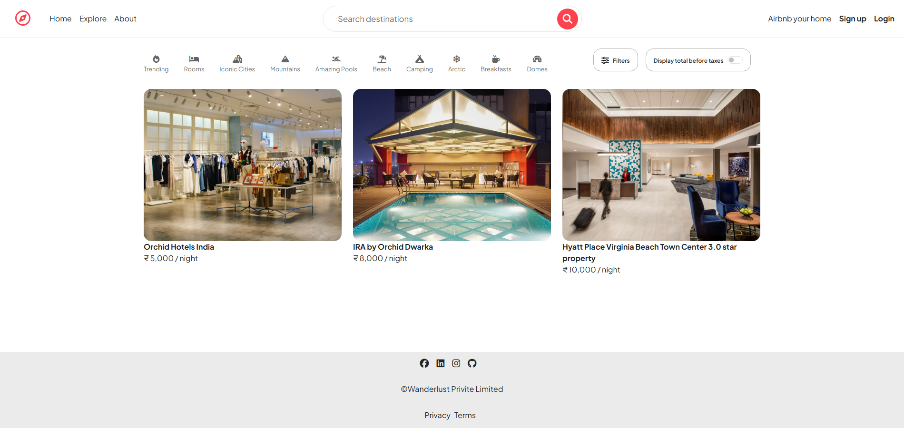

# WanderLust

WanderLust is a full-stack accommodation listing application. Users can browse and search listings, create an account, publish and manage their own listings, upload images, and leave reviews.

## Live application

[Open WanderLust](https://major-swart-eight.vercel.app/)

## Screenshot

[](https://major-swart-eight.vercel.app/)

## Features

- User registration, login, logout, and session-based authentication
- Create, view, edit, search, and delete accommodation listings
- Listing ownership and review authorization
- Image uploads through Cloudinary
- Location geocoding and maps through Mapbox
- Reviews with server-side validation
- Flash messages and responsive EJS views
- MongoDB-backed sessions
- Vercel serverless deployment support

## Technology

- Node.js 20 and Express
- MongoDB Atlas and Mongoose
- EJS and EJS Mate
- Passport.js
- Cloudinary and Multer
- Mapbox
- Joi

## Local setup

### Prerequisites

- Node.js 20
- A MongoDB Atlas database
- Cloudinary and Mapbox accounts

### Installation

```bash
git clone https://github.com/panditsagar/major.git
cd major
npm install
```

Create a `.env` file in the project root:

```env
ATLASDB_URL=mongodb+srv://<username>:<password>@<cluster>/<database>
SECRET=<long-random-session-secret>
MAP_TOKEN=<mapbox-access-token>
CLOUD_NAME=<cloudinary-cloud-name>
CLOUD_API_KEY=<cloudinary-api-key>
CLOUD_API_SECRET=<cloudinary-api-secret>
```

Do not commit `.env` or expose these values in frontend code.

Start the application:

```bash
npm start
```

The local server runs at `http://localhost:8080` by default.

For development with automatic restart:

```bash
npm run dev
```

## Vercel deployment

1. Import this GitHub repository into Vercel.
2. Add all six variables from the `.env` example under **Project Settings → Environment Variables**.
3. In MongoDB Atlas, open **Database & Network Access → IP Access List**.
4. Add `0.0.0.0/0` to permit connections from Vercel's dynamic serverless IP addresses.
5. Redeploy the project after changing environment variables or network access.

Allowing `0.0.0.0/0` makes the database endpoint reachable from any IP. Use a strong, unique database password, grant the database user only the permissions the application needs, and keep the connection string secret.

## Project structure

```text
controllers/  Request handlers and application logic
models/       Mongoose models
public/       Browser JavaScript, CSS, and images
routes/       Express route definitions
utils/        Error and async helpers
views/        EJS templates and layouts
app.js        Express configuration and serverless export
```

## License

This project is licensed under the ISC License.
